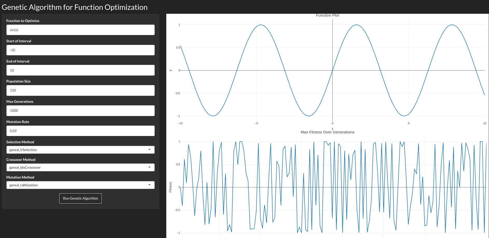
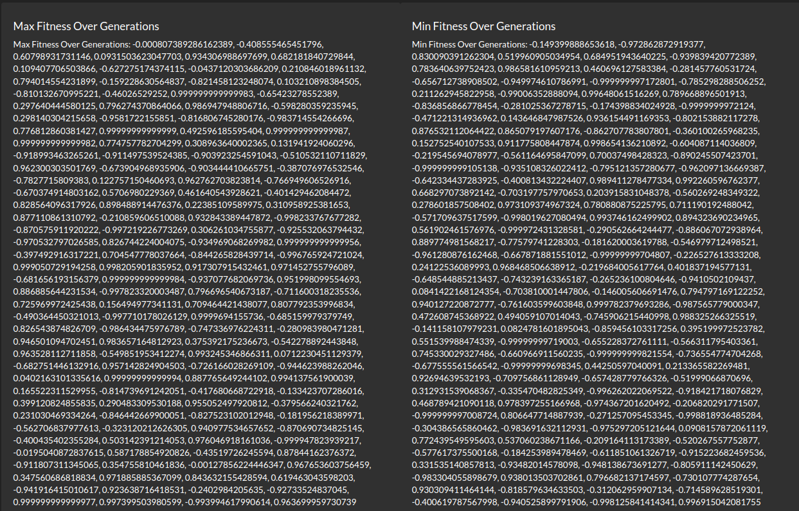

# Genetic Optimization for function

Simple project using R to showcase genetic algorithms to find the optima of custom math functions (+ their graphs).

## TODO List

- [X] R script + genetic algorithm for custom functions.
- [ ] Implement selecting different crossover methods.
- [ ] Implement selecting different mutation methods.
- [ ] Implement selecting different selection methods.
- [ ] Support for more advanced functions (with 3D graphs e.t.c)

## Screenshots

