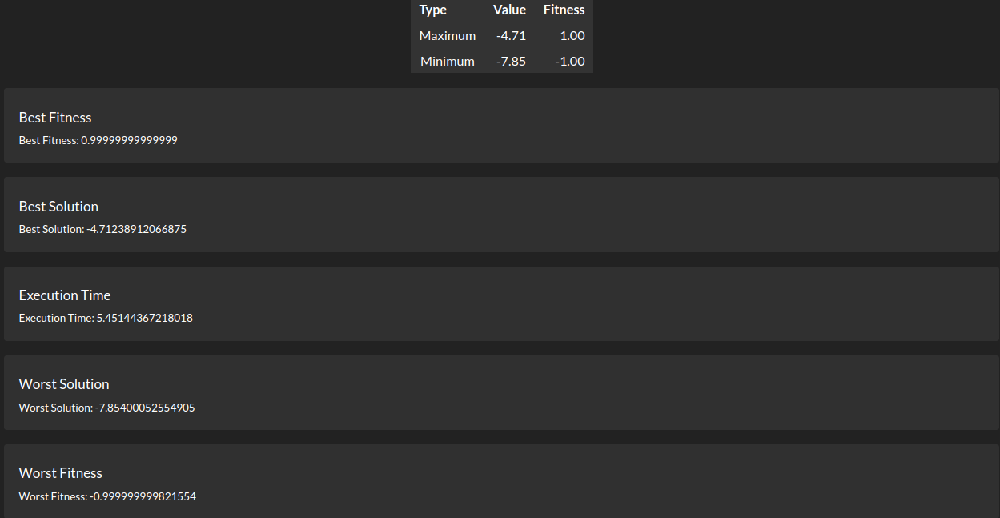

# Genetic Optimization for function

Simple project using R to showcase genetic algorithms to find the optima of math functions (1 variable + their graph)

## TODO List

- [X] R script + genetic algorithm for custom functions.
- [X] Implement selecting different crossover methods.
- [X] Implement selecting different mutation methods.
- [X] Implement selecting different selection methods.

## Screenshots

